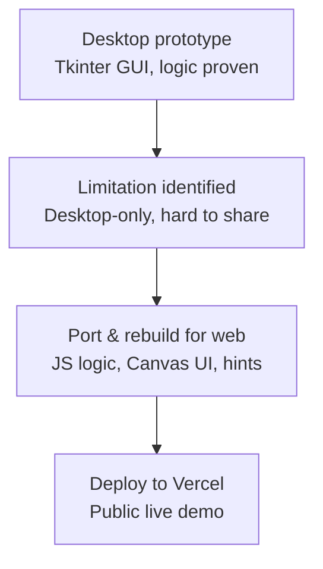
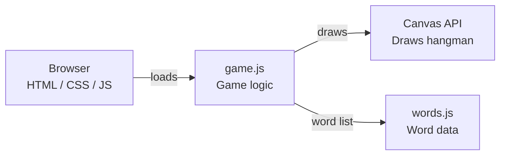
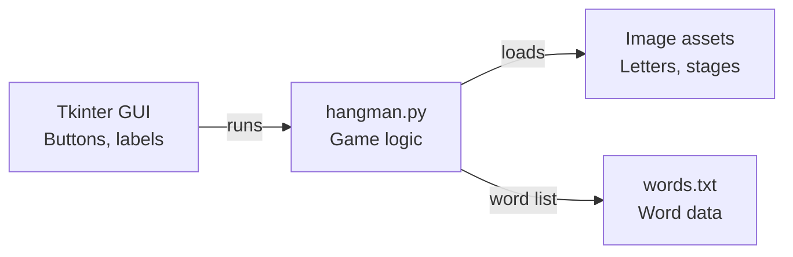
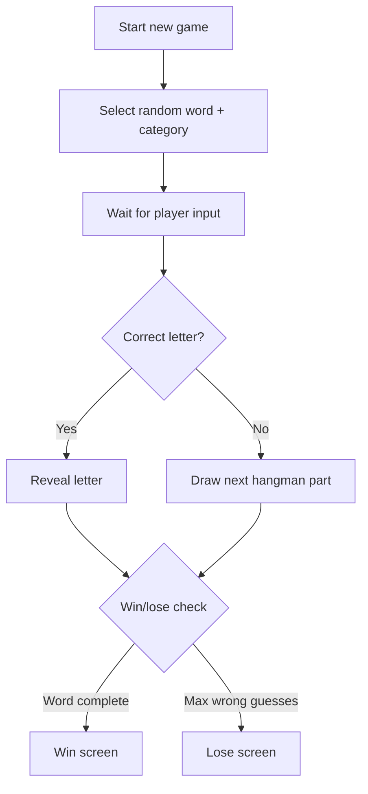

# 🎮 Hangman — Python Desktop + Web Version

[](https://docs.python.org/3/library/tkinter.html)
[](https://developer.mozilla.org/en-US/docs/Web/API/Canvas_API)
[](https://hangman-game-topaz-two.vercel.app/)
[](#license)

A two-part evolution of the classic Hangman game — first built as a Python desktop application, then re-implemented as a browser-playable web app to explore UX, accessibility, and deployment beyond the desktop.

**🔗 Live Demo (Web Version):** [hangman-game-topaz-two.vercel.app](https://hangman-game-topaz-two.vercel.app/)

---

## Table of Contents

- [Purpose](#purpose)
- [Project Sections](#project-sections)
- [Why Two Versions?](#why-two-versions)
- [Development Workflow](#development-workflow)
- [Game Logic Flow](#game-logic-flow)
- [Tech Stack](#tech-stack)
- [Project Structure](#project-structure)
- [Getting Started](#getting-started)
- [Features](#features)
- [Deployment](#deployment)
- [Limitations](#limitations)
- [Future Improvements](#future-improvements)
- [Contributing](#contributing)
- [License](#license)
- [Author](#author)

---

## Purpose

The project started as a desktop game using Python and Tkinter, then was later expanded into a browser-playable version to improve accessibility, interactivity, and deployment experience. This dual-version structure is meant to demonstrate product thinking, iteration, and adaptability across platforms rather than just a single finished build.

## Project Sections

### 🐍 Python Version (Desktop — Tkinter)
- **Path:** `/python-version/`
- **Tech:** Python, Tkinter
- **Interaction:** GUI, buttons, labels

### 🌐 Web Version (Browser — JavaScript + Canvas)
- **Path:** `/web-version/`
- **Tech:** HTML, CSS, JavaScript, Canvas API
- **Features:** Hint system, category labels, bubble keyboard, animations
- **Live Demo:** [hangman-game-topaz-two.vercel.app](https://hangman-game-topaz-two.vercel.app/)

## Why Two Versions?

| Version | Focus |
|---|---|
| Python (Tkinter) | Core game logic and desktop GUI fundamentals |
| Web (JS + Canvas) | UX, accessibility, UI polish, and deployment |

This evolution is meant to show:
- Product thinking — recognizing a desktop app has limited reach
- Engineering adaptability — porting core logic across a completely different UI paradigm
- Frontend and GUI programming, side by side
- Deployment skills (Vercel)
- Iterative improvement over a single project rather than a one-off build

## Development Workflow

How the project evolved from desktop prototype to deployed web app:



## Architecture

**Web version** — the browser loads `game.js`, which renders the drawing via the Canvas API and reads its word list from `words.js`:



**Python version** — Tkinter runs `hangman.py`, which loads the letter/stage images and reads its word list from `words.txt`:



## Game Logic Flow

The core turn-by-turn loop, shared conceptually across both versions:



## Tech Stack

| Version | Technologies |
|---|---|
| Python | Python, Tkinter, `random` |
| Web | HTML, CSS, JavaScript, Canvas API |
| Deployment | Vercel |
| Packaging (optional) | PyInstaller |

## Project Structure

```
Hangman-Game/
├── python-version/
│   ├── images/
│   │   ├── A.png ... Z.png       # Letter tile images
│   │   ├── h1.png ... h7.png     # Hangman drawing stages
│   │   └── exit.png
│   ├── hangman.py                 # Main game script
│   ├── words.txt                  # Word list
│   └── README.md
└── web-version/
    └── src/
        ├── index.html             # Main HTML file
        ├── style.css              # Styling and layout
        ├── game.js                # Core game logic
        ├── words.js               # Word list for the game
        └── hangman.png            # Hangman image asset
```

## Getting Started

### Web Version
No dependencies required:

```bash
cd web-version/src
open index.html
```

### Python Version

```bash
cd python-version
pip install -r requirements.txt
python hangman.py
```

## Features

- Hint button
- Category display
- Bubble keyboard UI
- Physical keyboard input support
- Beginner-friendly word list
- Canvas-based hangman drawing
- Win/lose screens
- Responsive layout

## Deployment

The web version is hosted on **Vercel (Free Tier)**. It's a static deployment — `web-version/src` is served directly with no build step required, since the game runs entirely in vanilla HTML/CSS/JS.

## Limitations

- The Python and Web versions maintain separate word lists (`words.txt` vs `words.js`) rather than a single shared source, so they can drift out of sync if one is updated without the other.
- The Python version has no packaged executable checked into the repo — running it requires a local Python environment.
- No persistence (scores, streaks, or word history) in either version; every session starts fresh.

## Future Improvements

- Unify the word list into a single shared source consumed by both versions
- Add score tracking / win-streak persistence to the web version
- Package the Python version into a standalone executable via PyInstaller
- Add sound effects and difficulty levels
- Mobile-responsive touch keyboard for the web version

## Contributing

Contributions are welcome. Please open an issue to discuss a change before submitting a pull request, and keep PRs focused on a single improvement or fix.

## License

This project is licensed under the MIT License. See the [LICENSE](LICENSE) file for details.

## Author

**Abdul Samad**

---

⭐ If you like this project, consider giving it a star to support it!
